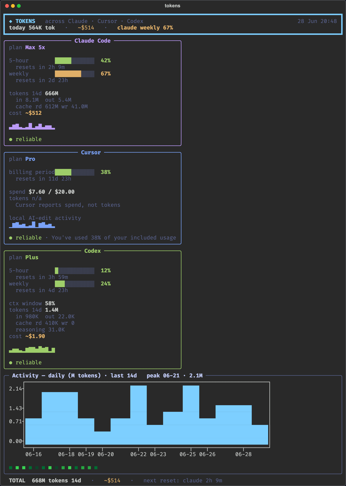

# tokens

One terminal command — `tokens` — that shows token usage, real rate-limits, cost,
and an activity graph across **Claude Code**, **Cursor**, and **Codex**, all in one
cinematic dashboard.



## Install

```bash
uv tool install --force .      # puts `tokens` on your PATH (~/.local/bin)
```

Update after pulling changes: re-run the same command.

## Usage

```bash
tokens                 # full dashboard (all three tools), one-shot
tokens --watch         # live-refreshing view (alt-screen, q / Ctrl-C to quit)
tokens --json          # machine-readable JSON, no colour (pipe-friendly)
tokens claude          # focus a single tool (claude | cursor | codex)
tokens --days 30       # widen the token window + activity graph (default 14)
tokens --no-cost       # hide dollar estimates
tokens --estimate      # skip Claude Keychain/OAuth, estimate limits instead
tokens --refresh-prices  # re-download the LiteLLM price card for exact $ rates
```

## Where the numbers come from

| Tool | Tokens / activity | Real limits | How |
|------|-------------------|-------------|-----|
| **Claude Code** | `~/.claude/projects/**/*.jsonl` (deduped by message id) | 5-hour + weekly % and reset | OAuth token from macOS Keychain → `api.anthropic.com/api/oauth/usage` |
| **Codex** | `~/.codex/sessions/**/rollout-*.jsonl` | 5-hour + weekly % and reset (fully local) | last `token_count` event's `rate_limits` |
| **Cursor** | local AI-edit activity (`ai-code-tracking.db`) | billing-period spend % | session JWT from `state.vscdb` → Cursor dashboard RPC |

Reliability is shown per panel: `● reliable` (real data), `◐ estimate`, `○ unavailable`.

### Honesty notes
- **Cost is an estimate** (`~$`) — priced from the LiteLLM card / an embedded
  snapshot of real 2026 list prices. It tracks `ccusage` within ~10–15%; the small
  gap is because this tool *also* counts sub-agent (sidechain) usage, which is real
  consumption against your limits.
- **Claude weekly/5-hour %** is the only place a real quota lives — it is **not** in
  the local JSONL, so it needs the OAuth token. With `--estimate` it's reconstructed
  from your plan tier and clearly labelled.
- **Cursor reports dollars, not tokens** — the panel shows spend `$used / $limit`,
  and the sparkline is local AI-edit activity, not token volume.
- **Codex limits can be stale** if you haven't run Codex recently — the panel says
  `limits as of N ago` and a rolled-over window is shown honestly.

## Architecture

```
src/tokens/
  cli.py              argparse, dispatch, --watch / --json
  config.py           paths, env overrides, palette
  models.py           uniform ToolUsage / Bucket / Tokens dataclasses
  cache.py            incremental, mtime-keyed JSONL cache (~10k Claude files)
  pricing.py          LiteLLM card + embedded fallback
  sources/            claude.py · codex.py · cursor.py  (each -> ToolUsage)
  render/             theme.py · charts.py (plotext-in-rich) · dashboard.py
```

First run cold-builds the Claude file cache (~10–15s for ~10k files); subsequent
runs are warm (~1–2s).

## Tests

```bash
uv run pytest -q
```

External APIs are mocked; parsing is tested on fixtures — nothing touches the real
network or your Keychain.
